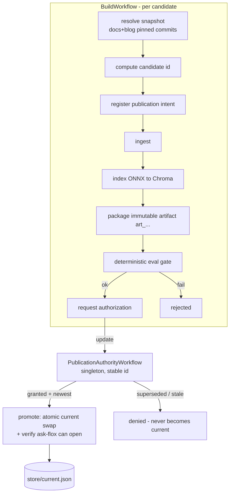

# Durable ask-flox index pipeline — architecture

This document describes the durable, reproducible ingestion/publication pipeline
that sits on top of the existing `pipeline/` stages. It turns "rebuild the index
and hope" into a workflow that survives interruption, orders publication safely,
and records exactly how every published index was produced.

> **Status:** Phase 1 (correctness spine) is implemented and demonstrated.
> Phases 2–5 (durable-processing polish, agentic evaluation, human review,
> operational hardening) are staged — see `PROMPT_ask_flox_temporal_flox_ingestion_v2.md` §23.

## Division of responsibility

- **Temporal owns durable workflow state and coordination** — candidate
  lifecycle, stage sequencing, retries, timeouts, supersession ordering, and
  resumability across worker/process failure.
- **Flox owns the declared, reproducible software environment** — Python 3.13,
  the parsers/embedders/Chroma, the Temporal SDK + dev server, all pinned in the
  composed lockfile so the pipeline runs the same everywhere.
- **External/model output is not assumed deterministic.** Flox reproduces the
  *software*; it does not make a remote API, a live repo, wall-clock time, a human
  decision, or a nondeterministic model response reproducible. Those inputs are
  captured explicitly (snapshots, persisted outputs, provenance). Phase 1 uses the
  torch-free ONNX embedder, which *is* deterministic on CPU, so the accelerator is
  recorded as provenance but excluded from identity.

## The three concepts we never conflate

| Concept | Answers | Where |
|---|---|---|
| **Source snapshot** | *what content was requested* | `snapshot.py` — repos pinned to exact commits; admitted-file manifest hashed to `src_…`/`snap_…` |
| **Candidate identity** | *what computation was requested* | `candidate.py` — canonical, schema-versioned hash of output-affecting inputs → `cand_…` |
| **Publication generation** | *whether this candidate is still desired* | `authority.py` + `PublicationAuthorityWorkflow` — monotonic generations; a superseded one can never become current |

Distinct from all three: the **artifact digest** (`art_…`, content hash of the
produced index files, `store.py`) and the **published version** (the immutable
label exposed to consumers).

## Flow



## Workflow / activity boundaries

Workflow code (`workflows.py`) is deterministic and replay-safe. Every side
effect is an Activity (`activities.py`): git access, filesystem mutation, the
subprocess pipeline stages, Chroma operations, Temporal-client calls, clock
reads. Large payloads (chunks, embeddings, index files) never travel through
Temporal history — they live in the store and are referenced by id/digest/hash.

**Publication authority.** `PublicationAuthorityWorkflow` is a singleton (stable
Workflow ID `ask-flox-pub-authority`). Because one workflow processes its updates
one-at-a-time, generation-aware compare-and-set needs no locks. It is the *only*
writer of the `current` pointer (via `promote_activity`), so two builds finishing
at once cannot race. It bounds its own history with Continue-As-New.

**Supersession rule.** Every new build request `register`s a new generation,
which becomes the desired one. `authorize` grants only for the desired generation
and only if it is newer than what is published; a superseded generation is denied
even if its build finishes last. Human approval (Phase 4) will not override this.

## Artifact storage & how ask-flox chooses the active index

Everything durable lives under `AI_BRIEF_STORE_DIR` (default `state/store`):

```
snapshots/<snapshot_id>/<source>/<path>   materialized, pinned sources
candidates/<candidate_id>/work/           per-candidate build staging
artifacts/<artifact_digest>.tar.gz        immutable, content-addressed indexes
provenance/<candidate_id>.json            how it was produced
published/<candidate_id>.json             publish record (idempotency anchor)
current.json                              the active pointer (atomic os.replace)
```

`current.json` names the active `artifact_digest` + version + generation.
Consumers read `current`, never a half-written pointer (single writer + atomic
rename). Artifacts are never mutated in place. Byte-for-byte identical Chroma
files across rebuilds are **not** required; the artifact digest hashes file
*contents* deterministically instead.

The **seam to real publication** (FloxHub `flox-labs/ask-flox`) is deliberate:
today's release path (`refresh-ask-flox-index.sh` + `flox publish`) can be driven
from a promoted artifact in a later phase without changing the authority model.

## Evaluation gate (deterministic)

`evaluate.py` runs only deterministic checks before publication: the index opens
and is non-empty; required manifest fields are valid; every chunk has provenance
that resolves to an admitted snapshot file; no empty chunks; manifest count
matches the collection; representative queries retrieve real passages. A build
that fails the gate is `rejected` and never requests authorization. Model-based
evaluation, when added (Phase 3), stays separate and cannot mask a deterministic
failure.

## Idempotency, retry, and resume

- Source materialization, packaging, and publication are idempotent
  (content-addressed paths + atomic writes + a published record).
- Activities carry bounded retries; deterministic bad input (e.g. a dirty work
  tree) fails fast rather than looping.
- On worker restart, Temporal replays completed activities from history rather
  than re-running them, so interrupted builds resume without redoing expensive
  work (crash/resume demonstration — Phase 2).

## Temporal history / versioning strategy

- Large data stays out of history (references only); the authority uses
  Continue-As-New to cap history growth.
- Workflow code changes must stay replay-compatible with in-flight executions;
  the documented approach is Temporal's supported versioning/patching (and, where
  available, Worker Versioning) — see Phase 5.

## Local setup & commands

```bash
flox activate -s        # composes the stack AND starts the Temporal dev server
just worker             # run the worker (workflows + activities)

just pipeline-submit --docs-ref HEAD --blog-ref HEAD --wait   # start a build
just pipeline-status <workflow-id>                            # inspect a build
just pipeline-authority                                       # authority state
just pipeline-current                                         # active index + provenance

just otests             # pure correctness-spine unit tests (no server needed)
python scripts/demo-e2e.py   # full pipeline + supersession race (server+worker up)
```

Source repos default to `$ASK_FLOX_DOCS_REPO` (github.com/flox/docs) and
`$ASK_FLOX_BLOG_REPO` (github.com/flox/floxwebsite); override to point at any
local checkout. The Temporal Web UI is at http://localhost:8233.
