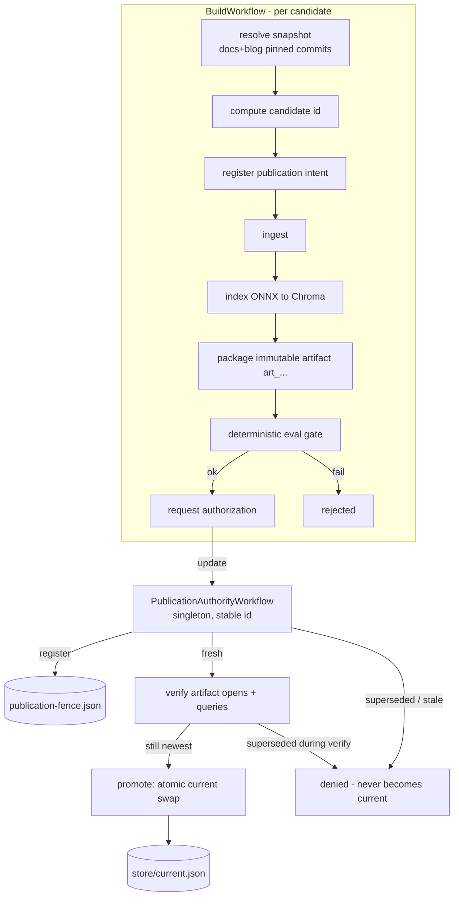

# Durable ask-flox index pipeline — architecture

This document describes the durable, reproducible ingestion/publication pipeline
that sits on top of the existing `pipeline/` stages. It turns "rebuild the index
and hope" into a workflow that survives interruption, orders publication safely,
and records exactly how every published index was produced.

> **Status:** Phase 1 (correctness spine), Phase 2 (durable processing +
> incremental reuse), and Phase 4 (durable human review) are implemented and
> demonstrated. Phase 3 (agentic enrichment) was intentionally dropped — the
> pipeline stays fully offline and keyless, with no external model calls. Phase 5
> (operational hardening) is staged — see
> `PROMPT_ask_flox_temporal_flox_ingestion_v2.md` §23.

## Division of responsibility

- **Temporal owns durable workflow state and coordination** — candidate
  lifecycle, stage sequencing, retries, timeouts, supersession ordering, and
  resumability across worker/process failure.
- **Flox owns the declared, reproducible software environment** — Python 3.13,
  the parsers/embedders/Chroma, the Temporal SDK + dev server, all pinned in the
  composed lockfile so the pipeline runs the same everywhere.
- **External/model output is not assumed deterministic.** Flox reproduces the
  *software*; it does not make a remote API, a live repo, wall-clock time, a human
  decision, or a nondeterministic model response reproducible. Those inputs are
  captured explicitly (snapshots, persisted outputs, provenance). Phase 1 uses the
  torch-free ONNX embedder, which *is* deterministic on CPU, so the accelerator is
  recorded as provenance but excluded from identity.

## The three concepts we never conflate

| Concept | Answers | Where |
|---|---|---|
| **Source snapshot** | *what content was requested* | `snapshot.py` — repos pinned to exact commits; admitted-file manifest hashed to `src_…`/`snap_…` |
| **Candidate identity** | *what computation was requested* | `candidate.py` — canonical, schema-versioned hash of output-affecting inputs → `cand_…` |
| **Publication generation** | *whether this candidate is still desired* | `authority.py` + `PublicationAuthorityWorkflow` — monotonic generations; a superseded one can never become current |

Distinct from all three: the **artifact digest** (`art_…`, content hash of the
produced index files, `store.py`) and the **published version** (the immutable
label exposed to consumers).

## Flow



## Workflow / activity boundaries

Workflow code (`workflows.py`) is deterministic and replay-safe. Every side
effect is an Activity (`activities.py`): git access, filesystem mutation, the
subprocess pipeline stages, Chroma operations, Temporal-client calls, clock
reads. Large payloads (chunks, embeddings, index files) never travel through
Temporal history — they live in the store and are referenced by id/digest/hash.

**Publication authority.** `PublicationAuthorityWorkflow` is a singleton (stable
Workflow ID `ask-flox-pub-authority`). Temporal runs async Update handlers as
concurrent tasks, so state mutation and the final pointer swap share a
workflow-local `asyncio.Lock`. Slow artifact verification runs outside that lock;
`authorize` re-checks freshness after verification and before promotion, so a
new generation can supersede an older request while it verifies.
Registration also persists the newest `(generation, candidate)` as a durable
publication fence before the Update completes. `promote_activity` is the only
logical writer of `current`; the fence update and pointer compare/swap share one
filesystem lock. A timed-out Activity that keeps running cannot publish after a
newer registration has crossed that fence. The workflow bounds its own history
with Continue-As-New. The command-sequence change is guarded by Temporal's
`workflow.patched` API so pre-change histories retain their original replay path;
legacy promotion requests still verify, re-query the live authority state, and
establish a migration fence before mutating `current`.

**Supersession rule.** Every new build request `register`s a new generation,
which becomes the desired one. `authorize` grants only for the desired generation
and only if it is newer than what is published; a superseded generation is denied
even if its build finishes last. Human approval (Phase 4) will not override this.

## Artifact storage & how ask-flox chooses the active index

Everything durable lives under `AI_BRIEF_STORE_DIR` (default `state/store`):

```
snapshots/<snapshot_id>/<source>/<path>   materialized, pinned sources
candidates/<candidate_id>/work/           per-candidate build staging
artifacts/<artifact_digest>.tar.gz        immutable, content-addressed indexes
provenance/<candidate_id>.json            how it was produced
published/<candidate_id>.json             publish record (idempotency anchor)
publication-fence.json                    newest registered generation + candidate
current.json                              the active pointer (atomic os.replace)
```

`current.json` names the active `artifact_digest` + version + generation.
Consumers read `current`, never a half-written pointer: the publication fence and
pointer swap use one filesystem lock, and the final `os.replace` is atomic for
readers. Once a newer registration is fenced, an older generation is rejected
even if a stale Activity attempt runs late. Artifacts are never mutated in place.
Byte-for-byte identical Chroma files across rebuilds are **not** required; the artifact digest hashes
file *contents* deterministically instead.

The **seam to real publication** (FloxHub `flox-labs/ask-flox`) is deliberate:
today's release path (`refresh-ask-flox-index.sh` + `flox publish`) can be driven
from a promoted artifact in a later phase without changing the authority model.

## Evaluation gate (deterministic)

`evaluate.py` runs only deterministic checks before publication: the index opens
and is non-empty; required manifest fields are valid; every chunk has provenance
that resolves to an admitted snapshot file; no empty chunks; manifest count
matches the collection; representative queries retrieve real passages. A build
that fails the gate is `rejected` and never requests authorization. Model-based
evaluation, when added (Phase 3), stays separate and cannot mask a deterministic
failure.

## Idempotency, retry, and resume

- Source materialization, packaging, and publication are idempotent
  (content-addressed paths + atomic writes + a published record).
- Activities carry bounded retries; deterministic bad input (e.g. a dirty work
  tree) fails fast rather than looping.
- On worker restart, Temporal replays completed activities from history rather
  than re-running them, so interrupted builds resume without redoing expensive
  work (`scripts/demo-crash-resume.sh`).

## Incremental reuse (Phase 2)

Two layers avoid repeating expensive work whose output is already known (§12):

- **Candidate-level reuse.** Identical inputs produce an identical `candidate_id`;
  if that candidate's immutable artifact already exists, `BuildWorkflow` skips
  ingest/index/package (stage `reusing`) and goes straight to re-verify + publish.
- **Embedding cache** (`pipeline/embed_cache.py`). A content-addressed store keyed
  by `(engine, model, dim, sha256(text))` under `AI_BRIEF_STORE_DIR/embed-cache`.
  `index.py` consults it before embedding, so a crash-interrupted index resumes
  without recomputing vectors it already produced, and a build whose sources barely
  changed re-embeds only the changed chunks. The identity is in the key, so a
  model/engine/dimension change lands in a different namespace — never a stale hit.
  Concurrency is bounded (`max_concurrent_activities`) so parallel builds can't
  exhaust resources. Demonstrated by `scripts/demo-reuse.py`.

## Human review (Phase 4)

When a build is submitted with `--require-review`, the workflow — after the
deterministic gate passes and before requesting authorization — opens a review
request and **durably waits** (`workflow.wait_condition`) for a decision. Review
is workflow state, not a worker blocked on stdin or an open HTTP request, so it
survives worker restarts.

A reviewer submits a decision through a **validated Temporal Update**
(`submit_review`). The validator (`review.py`, pure and unit-tested) rejects a
decision that targets the wrong candidate, carries a stale review-request id, has
an invalid value, or conflicts with an already-recorded decision — *before* it
becomes workflow state. A verbatim re-submit of the recorded decision is
idempotent. The review request surfaces everything a reviewer needs (candidate
id, generation, snapshot + source commits, the eval evidence, allowed decisions,
schema version).

**Approval never overrides supersession.** Approval only lets the build proceed
to the authorization step; the publication authority is still consulted there, so
an approved-but-superseded candidate is denied and never becomes current.

Control surface: `just pipeline-reviews` lists builds awaiting review;
`just pipeline-decide <workflow-id> approve|reject` submits the decision.
Demonstrated by `scripts/demo-review.sh` (crash the worker mid-review, restart,
reject an invalid decision, then approve).

## Temporal history / versioning strategy

- Large data stays out of history (references only); the authority uses
  Continue-As-New to cap history growth.
- Workflow code changes must stay replay-compatible with in-flight executions;
  the documented approach is Temporal's supported versioning/patching (and, where
  available, Worker Versioning) — see Phase 5.

## Local setup & commands

```bash
flox activate -s        # composes the stack AND starts the Temporal dev server
just worker             # run the worker (workflows + activities)

just pipeline-submit --docs-ref HEAD --blog-ref HEAD --wait   # start a build
just pipeline-submit --require-review                         # gate publish on review
just pipeline-status <workflow-id>                            # inspect a build
just pipeline-reviews                                         # builds awaiting review
just pipeline-decide <workflow-id> approve                    # submit a decision
just pipeline-authority                                       # authority state
just pipeline-current                                         # active index + provenance

just otests             # pure correctness-spine unit tests (no server needed)
python scripts/demo-e2e.py   # full pipeline + supersession race (server+worker up)
```

Source repos default to `$ASK_FLOX_DOCS_REPO` (github.com/flox/docs) and
`$ASK_FLOX_BLOG_REPO` (github.com/flox/floxwebsite); override to point at any
local checkout. The Temporal Web UI is at http://localhost:8233.
